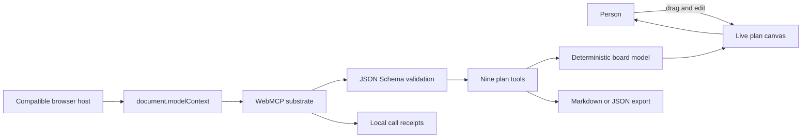

# Weave

**Turn one sentence into a clear, movable plan with browser-native site tools.**

Weave is an idea-to-plan canvas for trips, launches, essays, events, and any goal that needs structure. Open the page, state the outcome, and start shaping it. Cards appear on the same surface that you can drag and edit. Links show dependencies. Groups create clear lanes. A schedule turns the board into a timeline. The finished plan exports as Markdown or JSON.

There is no account, upload, configuration, or runtime network request. The page is useful from its first frame.

## Who it is for

Weave is for the moment before a planning system exists. A weekend traveler has a destination, a solo builder has a launch date, and a student has an essay prompt, but none of them should have to prepare a dataset or configure a workspace before making progress. The shared canvas gives each person a quick first structure and leaves them in control of the details.

Most planning assistants return a block of prose. Weave makes the plan itself the shared object. The browser can operate it through typed site tools while the person can touch the same cards directly.

## The one-minute experience

1. Open `index.html` or the deployed static URL.
2. Click **Build a sample plan** to watch 31 registered tool calls turn a Lisbon goal into a linked, grouped, scheduled board.
3. Drag a card, click its text to edit it, or switch between Canvas, Columns, and Timeline.
4. Export the plan as Markdown.

The sample uses the same registered tools as a compatible browser host. It is a local demonstration path, not a separate mock UI.

## Test it in ChatGPT's browser

Open the deployed Weave URL in ChatGPT's browser. Confirm that the address bar lists the page's site tools, then type this exact prompt:

> Use this page's site tools to plan a 3-day Lisbon trip. Add a goal plus practical cards, link dependencies, group them into Prep, Lisbon days, and Day trip, schedule the trip across three days, reflow it as a timeline, summarize the plan, and export it as Markdown.

ChatGPT can call the tools in sequence while the board changes in view. Navigating away from the page removes its tools from the browser session.

## Architecture



The native browser surface always wins when `document.modelContext` exists. A checked-in polyfill supports the local sample and contract tests. Direct `file://` use loads a checked-in compatibility runtime because browsers commonly block cross-file ES-module imports from local files. Hosted use loads the ES modules directly.

## Registered tools

| Tool | Visible result |
|---|---|
| `addCard(text, kind)` | Adds a goal, task, place, moment, or note |
| `updateCard(id, text)` | Edits a card without losing its structure |
| `linkCards(a, b)` | Draws a directional connection |
| `groupCards(ids, label)` | Collects related cards under one label |
| `setSchedule(id, when)` | Places a card on the schedule |
| `reflow(layout)` | Arranges the board as canvas, columns, or timeline |
| `summarizePlan()` | Returns totals, sections, schedule, and next moves |
| `exportPlan(format)` | Downloads Markdown or JSON locally |
| `clearBoard(confirm)` | Clears the plan only after a visible confirmation |

Every input is checked against a closed JSON Schema before the operation runs. Behavior is deterministic, and each success, refusal, and error receives a lightweight local receipt.

## Run locally

No install or build is required.

Open `index.html` directly for the complete local experience, or serve the directory for ES-module development:

```bash
python3 -m http.server 8080
```

Then open `http://localhost:8080`.

## Test

Requires Node.js 20 or newer. There are no package dependencies.

```bash
node --test
```

If an ES module changes, refresh the checked-in direct-file runtime before testing:

```bash
node scripts/generate-file-runtime.mjs
node --test
```

## Static deployment

The repository root is the publish directory. `netlify.toml` and `vercel.json` include static host settings and WebMCP-compatible origin headers. No build command, function, key, database, or standing service is required.

## Privacy and scope

Weave uses only the words added to the current tab. It does not load external data, collect personal information, call a backend, or persist the board after the tab closes. See [docs/LIMITATIONS.md](docs/LIMITATIONS.md) for the current boundaries.

## Citation

```bibtex
@software{sarkar_weave_2026,
  author = {Dipankar Sarkar},
  title = {Weave: A WebMCP Idea-to-Plan Canvas},
  year = {2026},
  url = {https://github.com/doom2quake/weave}
}
```

Built by the doom2quake collective. Released under the MIT License.
